# Data-Centric Physical AI Architecture — Diagrams

> **References**: `data-centric-zero-copy-design-20260510.md` (Status: APPROVED v2), `detailed_design_doc.md` (mechanism details).
>
> A collection of Mermaid diagrams: structural, sequence, and state. These are higher-resolution counterparts of the ASCII diagrams inside the detail document and can be embedded directly into the README, slides, and PR descriptions.
>
> **Rendering**: GitHub renders Mermaid natively. Locally, use VS Code's *Markdown Preview Mermaid Support* extension or `mermaid-cli` (`mmdc -i diagrams.md -o diagrams.svg`) to extract SVGs.

---

## Table of Contents

1. [System Architecture — 5 Planes](#1-system-architecture--5-planes) (detail doc §0)
2. [End-to-End Data Flow](#2-end-to-end-data-flow) (detail doc §0.2, §4.3)
3. [FD Handshake Sequence](#3-fd-handshake-sequence) (detail doc §1.3.3)
4. [End-to-End Sequence — T+0 → T+10.6ms](#4-end-to-end-sequence--t0--t106ms) (detail doc §4.3)
5. [FD Lifecycle State Machine](#5-fd-lifecycle-state-machine) (detail doc §4.2)
6. [Pool-Generation Change Sequence](#6-pool-generation-change-sequence) (detail doc §1.3.4)
7. [RT/non-RT Region Separation and Priority-Inversion Avoidance](#7-rtnon-rt-region-separation-and-priority-inversion-avoidance) (detail doc §3.1, §3.4)
8. [RT Consumer Seqlock Pattern](#8-rt-consumer-seqlock-pattern) (detail doc §3.3)
9. [Bounded Staleness — Visualized](#9-bounded-staleness--visualized) (detail doc §5)
10. [Risks → Mitigations](#10-risks--mitigations) (detail doc §9)
11. [Evolution Path — Phase 1 → Phase 4](#11-evolution-path--phase-1--phase-4) (detail doc §10)
12. [Week 1-2 Spike PoC Decision Tree](#12-week-1-2-spike-poc-decision-tree) (detail doc §6.4)

---

## 1. System Architecture — 5 Planes

How the five planes (metadata · FD · memory · time · sync) combine to form the path from sensor to control loop.

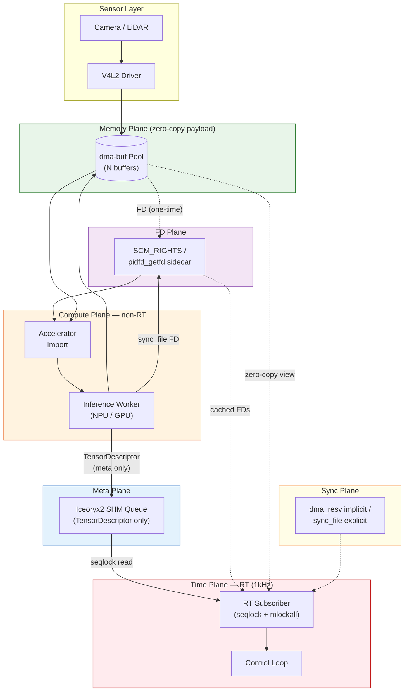

**Key observations**:
- The `dma-buf Pool` is a single block of memory. Capture, import, inference, and view all point at the same physical memory.
- Only ≤ 144 B of metadata flows over `Iceoryx2`. The payload does not flow.
- `SCM_RIGHTS` is dotted = used only at handshake time; it does not appear on the steady-state publish path.

---

## 2. End-to-End Data Flow

A simpler view of the same flow without the plane partitioning.

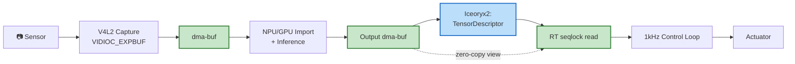

Green = zero-copy region (no host memory copy). Blue = metadata message.

---

## 3. FD Handshake Sequence

The producer delivers every dma-buf FD in the buffer pool to the consumer in a single shot, so the steady-state publish path has no sidecar calls.

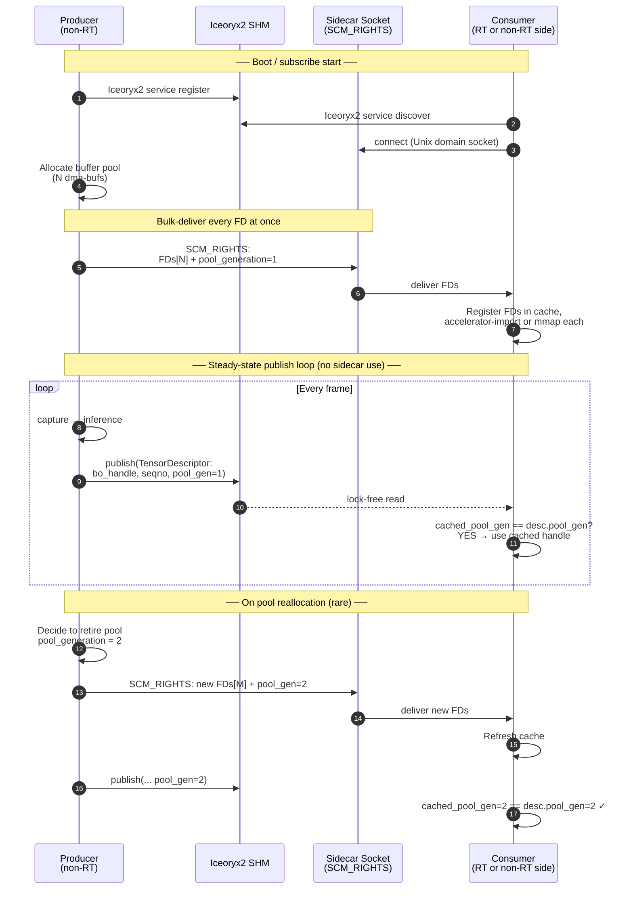

---

## 4. End-to-End Sequence — T+0 → T+10.6ms

Time axis from §4.3 of the detail document. Every step from capture to command inside one 1kHz cycle.

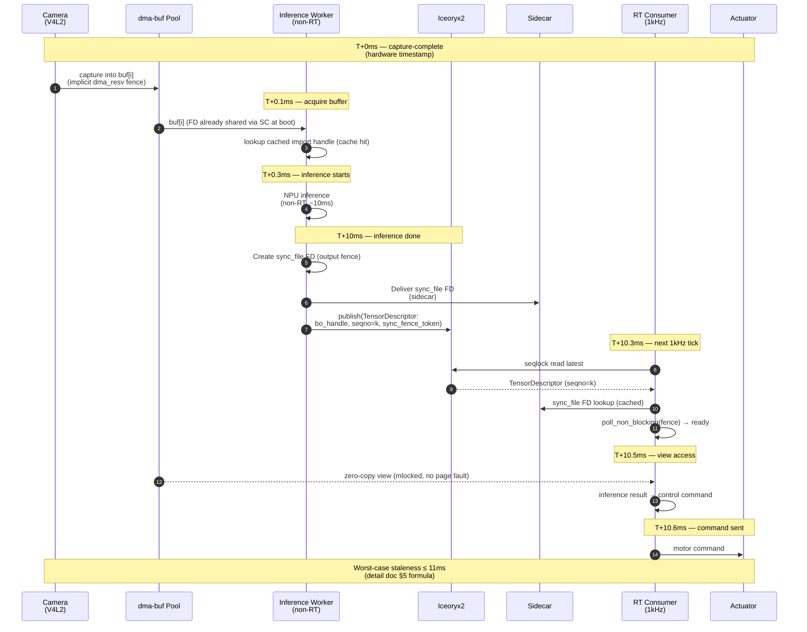

---

## 5. FD Lifecycle State Machine

Visualization of the state machine in detail doc §4.2.

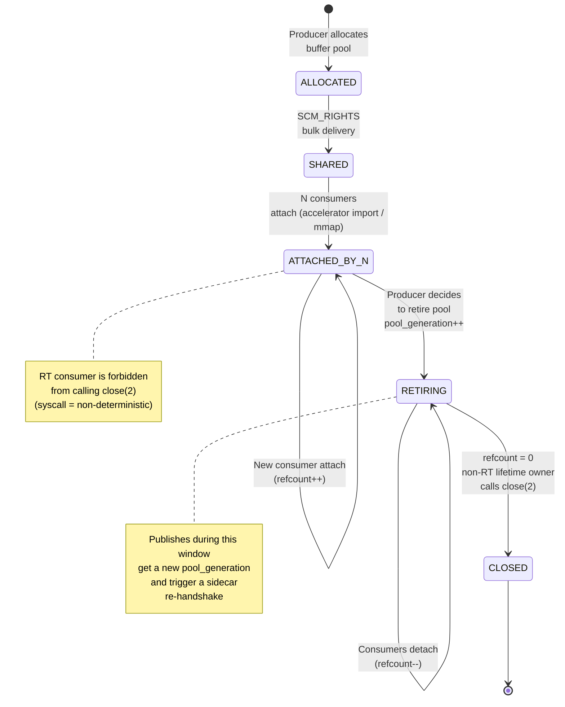

---

## 6. Pool-Generation Change Sequence

The rare path where the pool is reallocated. The consumer detects the stale generation and re-requests through the sidecar.

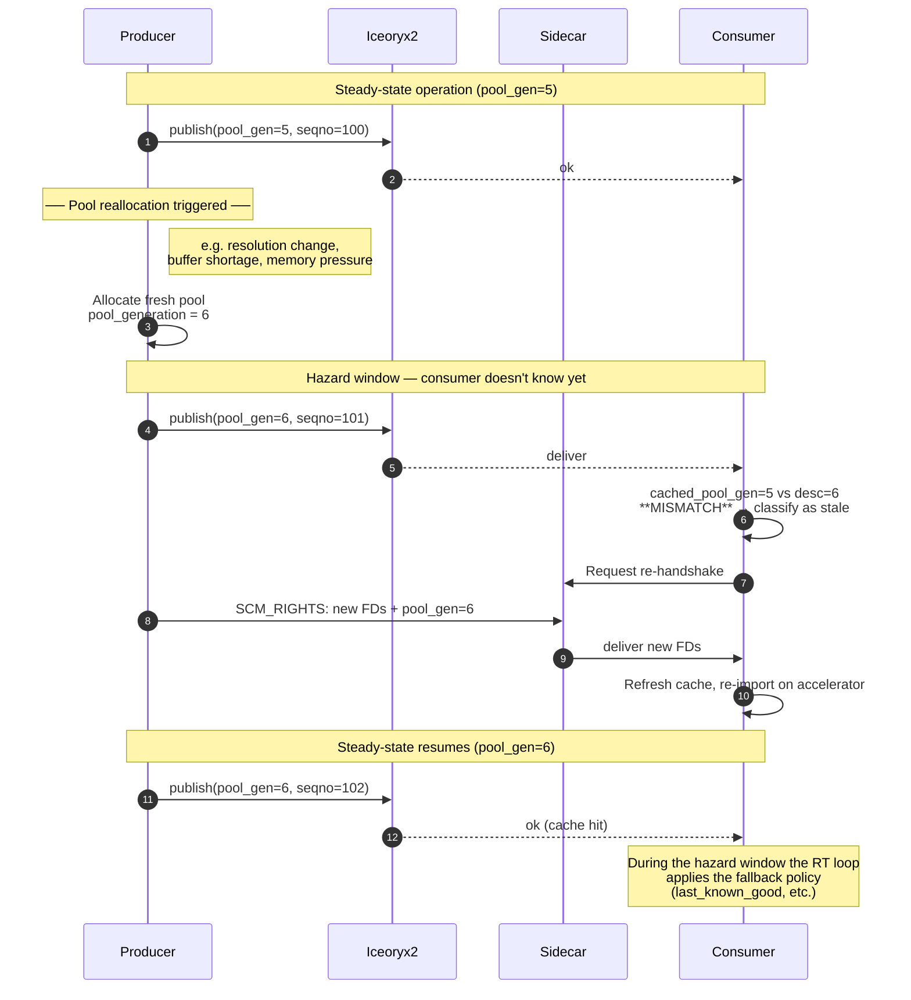

---

## 7. RT/non-RT Region Separation and Priority-Inversion Avoidance

Core principle: **dma-buf attach/detach is performed only by the producer / non-RT worker.** The RT consumer only reads views of attached handles.

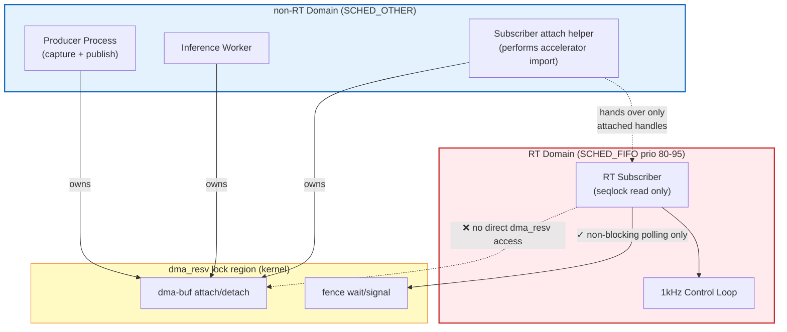

**Rules**:
- The red region must **never** acquire the locks of the yellow region directly.
- Locks in the yellow region are taken only from the blue region; the result (handle) is then passed to the red region.
- Fence access from the red region uses **non-blocking polling** with a bounded retry.

---

## 8. RT Consumer Seqlock Pattern

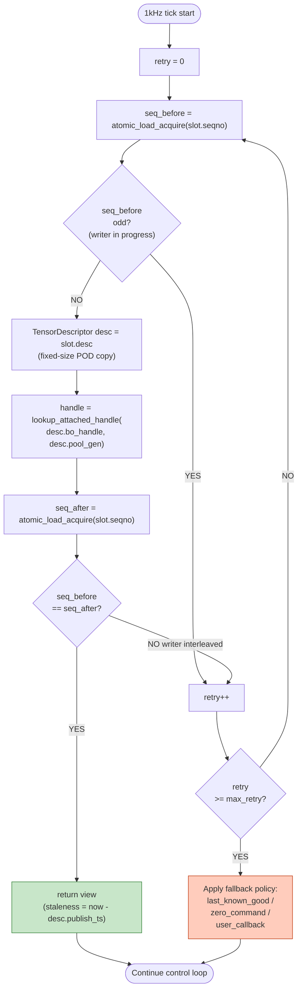

---

## 9. Bounded Staleness — Visualized

How the seven terms add up. Normal values assume Jetson Orin.

```mermaid
flowchart LR
    T_CAP["T_cap<br/>sensor capture<br/>→ dma-buf export<br/><b>100-500 µs</b>"]
    T_FENCE_P["T_fence_p<br/>producer fence wait<br/>(DMA_BUF_IOCTL_SYNC)<br/><b>10-100 µs</b>"]
    T_INF["T_inf<br/>inference worst-case<br/>(P99.99 + thermal)<br/><b>5-15 ms</b>"]
    T_PUB["T_pub<br/>Iceoryx2 publish<br/><b>1-10 µs</b>"]
    T_SC["T_sc<br/>sidecar handshake<br/>(amortized)<br/><b>≈0 steady</b>"]
    T_RT_SEQ["T_rt_seq<br/>seqlock retry<br/><b>0-hundreds of ns</b>"]
    T_VIEW["T_view<br/>dma-buf view access<br/>(mlock guarantees)<br/><b>≈0</b>"]
    SUM["worst_case_staleness<br/><b>≤ sum</b>"]

    T_CAP --> T_FENCE_P --> T_INF --> T_PUB --> T_SC --> T_RT_SEQ --> T_VIEW --> SUM

    style T_INF fill:#ffccbc,stroke:#bf360c
    style T_CAP fill:#fff9c4,stroke:#f57f17
    style T_FENCE_P fill:#fff9c4,stroke:#f57f17
    style T_PUB fill:#c8e6c9,stroke:#2e7d32
    style T_SC fill:#c8e6c9,stroke:#2e7d32
    style T_RT_SEQ fill:#c8e6c9,stroke:#2e7d32
    style T_VIEW fill:#c8e6c9,stroke:#2e7d32
    style SUM fill:#bbdefb,stroke:#1565c0,stroke-width:3px
```

**Color meaning**:
- 🔴 Red (`T_inf`) — the largest term. Model worst-case + thermal margin dominates the staleness bound.
- 🟡 Yellow (`T_cap`, `T_fence_p`) — non-trivial µs-level terms. Need careful measurement and edge-case validation.
- 🟢 Green (the rest) — guaranteed ≈0 by mlockall + Iceoryx2 lock-free + amortized handshake.

→ **The optimization priority is clearly `T_inf`, which is the model selection / quantization / thermal-solution problem.** What systems infrastructure has to do is keep the yellow and green terms ≈0.

---

## 10. Risks → Mitigations

Mapping the eleven risks (R1-R11) to where they are mitigated.

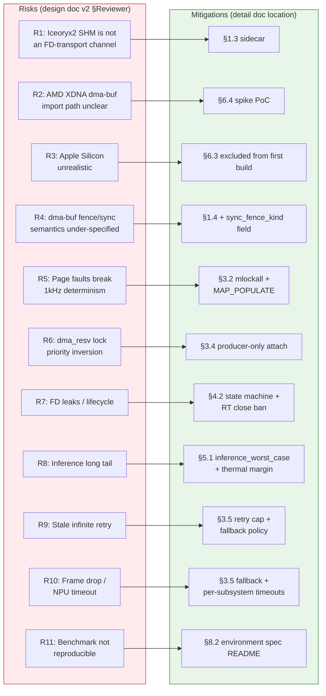

---

## 11. Evolution Path — Phase 1 → Phase 4

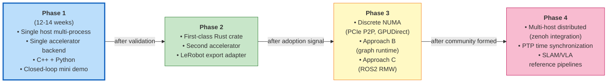

The transitions between phases are explicit — not "12 weeks elapsed → Phase 2" but **validation signal + adoption signal + community signal** as the trigger.

---

## 12. Week 1-2 Spike PoC Decision Tree

The spike checklist of detail doc §6.4 expressed as a decision tree.

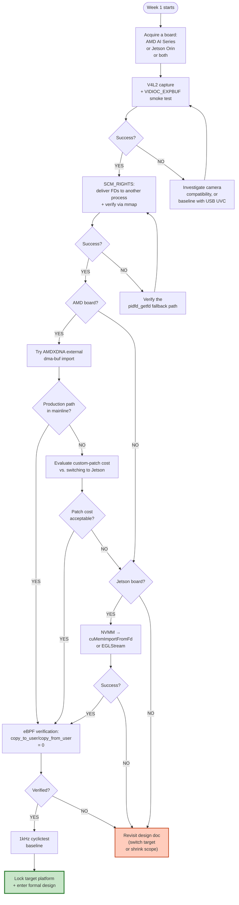

**Priority of decisions**:
1. **If both can be tried in week 1, smoke-test both** — fast plate validation.
2. If AMD has a production path, prefer AMD (open ecosystem).
3. If AMD's patch cost is high and Jetson succeeds → switch to Jetson.
4. Both fail → revisit design doc (Intel iGPU? Mali? or shrink scope).

---

## Appendix. Mermaid Rendering Tips

### GitHub
- Embed as-is in READMEs, issues, and PRs. Native support.
- Narrow viewports may clip nodes — prefer `flowchart LR` (horizontal) when possible.

### Local SVG Extraction
```bash
# Install mermaid-cli (npm or bun)
npm i -g @mermaid-js/mermaid-cli
mmdc -i diagrams.md -o diagrams.svg -t dark
```

### VS Code
- Extension: *Markdown Preview Mermaid Support*
- Zoom and scroll work in the preview pane.

### PNG Extraction (for slides)
```bash
mmdc -i diagrams.md -o diagrams.png -w 2400 -H 1600 --backgroundColor white
```
