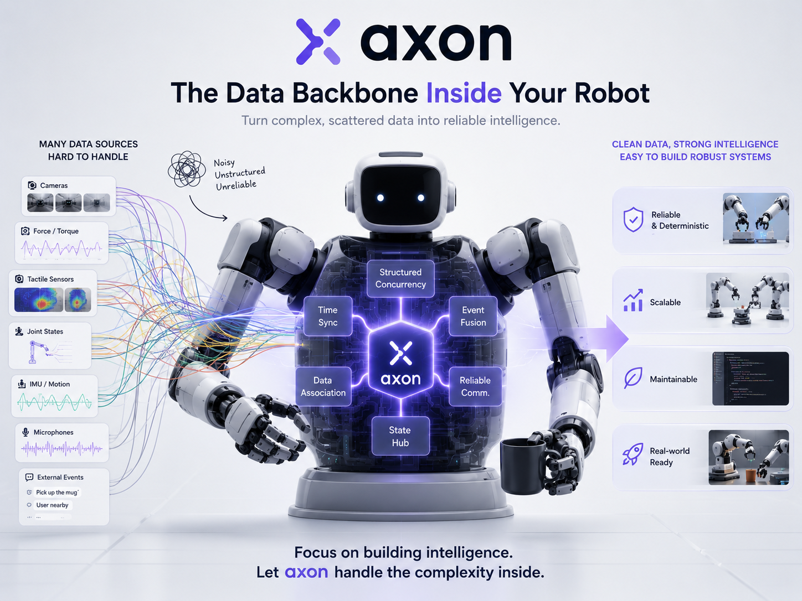
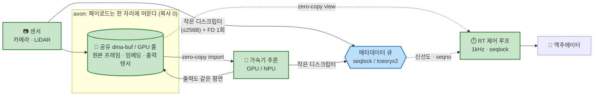
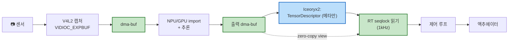
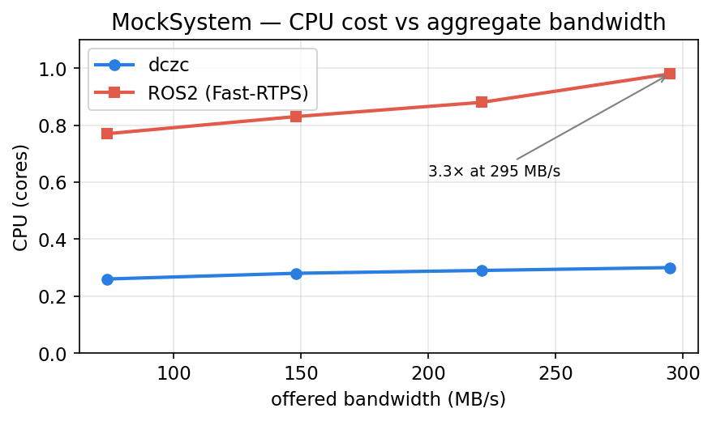
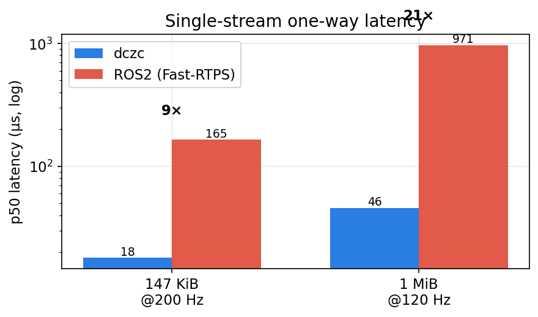
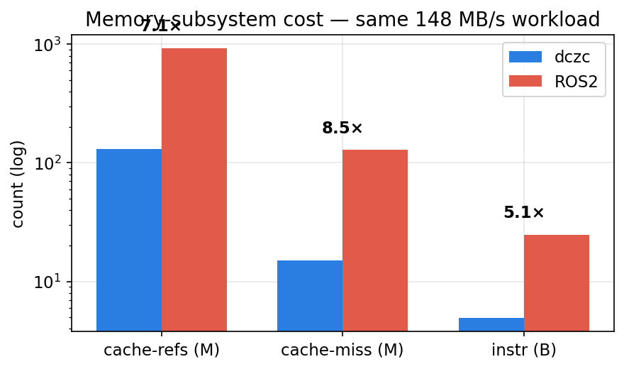

<!-- 이 파일(README.ko.md, 한국어)은 README.md(영어, 원본)의 번역본입니다. 어느 한쪽을 바꾸면 같은 커밋에서 두 파일을 함께 갱신하세요. -->

<p align="center">
  
</p>

# Axon — Physical AI를 위한 데이터 중심 Zero-Copy

[English](README.md) | **한국어**

> **한 줄 요약**: ROS2 위에 또 하나의 미들웨어를 얹는 게 아니다. **센서 → 가속기 → RT 제어 루프** 경로를 **끊기지 않는 end-to-end zero-copy**로 확장하고, **측정·보장되는 bounded staleness(신선도 한계)** 를 제공한다.

[]()
[](LICENSE)
[]()

> **상태**: 동작하는 라이브러리 + 실측 결과. 코어는 빌드·테스트 완료(9/9), 벤치마크·하드웨어 검증·ROS1/ROS2 연동·VLM 핸드오프 데모·프로세스 간 GPU accelerator pool 이 모두 이 개발 PC(RTX 5080)에서 동작한다. 처음이라면 **[docs/usage.md](docs/usage.md)**, [측정 결과](#측정-결과), [docs/hardware-verification.md](docs/hardware-verification.md) 를 보라.

---

## 개요

**무엇인가.** `axon`은 텐서 **페이로드를 공유 dma-buf(또는 GPU 할당)에 그대로 두고**, 모든 프로세스·가속기가 그것을 *자리에서* 참조하게 한다. 큐로는 고정 크기 디스크립터(≤256 B)만 흐르고, 버퍼의 FD는 `SCM_RIGHTS` 사이드카로 **최초 1회만** 전달된다. 한 줄로: **페이로드는 옮기지 말고, 자리에 두고 참조만 넘긴다.**

**왜인가.** 로봇 위의 Physical AI는 `센서 → 가속기 → RT 제어` 경로에서 **고대역폭 · 초저지연 · RT 결정성** 을 *동시에* 요구한다. 그런데 표준 미들웨어(ROS2 + DDS)는 프레임마다 텐서를 여러 번 복사한다. 그래서 페이로드가 클수록(4K 카메라·포인트클라우드·이미지 임베딩) 지연과 CPU가 **크기에 비례**해 커진다 — 바로 로봇이 가장 많은 바이트를 옮기는 지점에서. 게다가 staleness가 부하에 따라 흔들려 **안전 분석에 쓸 수 없다.** 메시지 레벨 zero-copy(Iceoryx2)는 메시지를 RAM까지 복사 없이 나르지만, **그것을 가속기에 올리는 순간 다시 복사**가 생기고 RT 신선도 보장은 여전히 비어 있다. `axon`은 이 두 빈틈을 메운다.

그림 한 장이면 충분하다: **초록(페이로드)은 한 자리에 머물고, 파랑(작은 메타데이터)만 움직인다.**



초록 = 자리에서 참조되고 절대 복사되지 않는 페이로드. 파랑 = 큐를 넘는 유일한 것. (단계별 구체적 파이프라인은 [데이터 흐름 한눈에](#데이터-흐름-한눈에)에 있고, 이것이 대체하는 복사 중심 ROS2/DDS 경로는 그 그림이 제거하는 4번 복사 사슬이다.)

**무엇이 좋아지나** — 전송 비용이 **페이로드 크기에 O(1)** 이라, 대역폭이 커져도 axon CPU는 평평한 반면 ROS2/DDS는 복사하는 바이트에 비례해 커진다. 이 개발 PC 실측:

### 핵심 결과 (실측, RTX 5080 / Ryzen 9800X3D vs ROS2/Fast-RTPS)

| 항목 | 결과 |
|---|---|
| 단일스트림 지연 (1 MiB) | **20.9× 낮음** (46 µs vs 971 µs) |
| 다중스트림 CPU @ 295 MB/s | **3.3× 적음** + 드롭 프레임 0 |
| 메모리 (동일 바이트) | **캐시미스 8.6× 적음**, 프레임당 syscall ~0 |
| RT 루프 page fault | **0 / frame** |
| GPU 프로세스 간 공유 | **zero-copy**, 200/200 프레임, 1.68 GB |
| VLM 인코더→LLM 핸드오프 (video 34 MB) | host 왕복 대비 **36× 빠름** |

자세한 내용은 [측정 결과](#측정-결과), 신선도 보장은 [목표 지표와 실측](#목표-지표와-실측)에 있다.

---

## 핵심 아이디어 (60초)

ROS2 + Iceoryx2 연동은 **메시지 미들웨어 레벨**에서 zero-copy를 제공한다. 메시지는 복사 없이 RAM까지 도달할 수 있지만, 그것을 가속기(NPU/GPU)에 올리려면 대개 또 한 번의 복사가 필요하다.

`axon`은 그 위에 **빠져 있던 두 평면**을 더한다:

1. **FD 평면** — dma-buf FD를 `SCM_RIGHTS` / `pidfd_getfd(2)` 사이드카로 직접 전달한다. V4L2 캡처가 export한 dma-buf를 가속기 드라이버가 import — **host 메모리 복사 없음.**
2. **시간 평면** — 추론은 비-RT 워커에서 돌고, RT 제어 루프는 seqlock으로 결과를 zero-copy view로 읽는다. staleness 한계는 **명시적 산식(7개 항)** 으로 계산되어 안전 분석에 바로 쓸 수 있다.

---

## 데이터 흐름 한눈에



초록 = zero-copy 영역. 파랑 = 메타데이터 메시지. 12개 다이어그램이 더 있다: [`DesignFiles/diagrams.md`](DesignFiles/diagrams.md).

---

## 목표 지표와 실측

워크스테이션(RTX 5080 / Ryzen 9800X3D, 비-RT 커널)에서 동일 워크로드로 ROS2 Jazzy / Fast-RTPS와 비교 측정. 전체 내용: [docs/hardware-verification.md](docs/hardware-verification.md).

| 지표 | 목표 | 실측 (axon vs ROS2) |
|---|---|---|
| 단일스트림 지연 (1 MiB) | 낮게 | **46 µs vs 971 µs — 20.9× 낮음** ✅ |
| 295 MB/s에서 CPU (다중스트림) | 대역폭에 평평 | **0.30 vs 0.98 cores — 3.3× 적음** ✅ |
| 부하 시 프레임 전달 | 드롭 없음 | **100 % vs ~96.7 %** ✅ |
| 메모리 복사 (동일 바이트) | 페이로드 복사 0 | **캐시미스 8.6× 적음; 프레임당 전송 syscall ~0** ✅ |
| RT 중 page fault | **0** | **0 / frame** (프레임 20배에도 평평) ✅ |
| GPU zero-copy import | 실제 하드웨어 | **RTX 5080: 200/200 프레임, 복사 0, 1.68 GB** ✅ |
| Staleness 한계 | 명시적 7개 항의 합 | 결정적 산식 (§5) ✅ |
| 1kHz RT 최악 지터 | < 100µs | PREEMPT_RT 커널 대기 🟡 |

산식:
```
worst_case_staleness ≤ 
    T_cap + T_fence_p + T_inf + T_pub
  + T_sc + T_rt_seq + T_view
```
[정의](DesignFiles/detailed_design_doc.md#5-bounded-staleness-formula) | [시각화](DesignFiles/diagrams.md#9-bounded-staleness--visualized)

---

## 측정 결과

핵심 명제는 전송 비용이 **페이로드 크기에 O(1)** 이라는 것이다: 고정 크기 디스크립터만 메타데이터 평면을 넘고 텐서는 공유 dma-buf에 남는다. 그래서 센서 대역폭이 커져도 axon CPU는 평평한 반면, ROS2/DDS는 직렬화·복사하는 페이로드에 비례해 커진다.

**대역폭이 커져도 CPU는 평평** (서빙 로봇 다중스트림 워크로드, [`benchmarks/mock`](benchmarks/mock/README.md)):



295 MB/s에서 axon은 **0.30 cores vs ROS2 0.98 (3.3×)** 를 쓰고, ROS2의 최악 스트림이 ~96.7 %로 떨어지는 동안 **드롭 0**. axon이 데이터 배관에 *쓰지 않는* CPU가 곧 인지·제어에 남는 CPU다.

**단일스트림 지연, 그리고 페이로드가 클수록 벌어진다** ([`benchmarks/`](benchmarks/)):



**복사는 공짜가 아니다** — 동일 전달 바이트, 커널 측정 ([docs/hardware-verification.md](docs/hardware-verification.md)):



ROS2는 같은 데이터를 옮기는 데 **캐시미스 8.6배**, **명령어 5배** 를 쓴다.

**로봇 보드 없이도 실제 GPU zero-copy.** axon의 FD 사이드카가 살아 있는 RTX 5080 GPU 메모리 핸들을 프로세스 간에 나른다: 200/200 프레임 on-GPU 검증, **host 페이로드 복사 0**, 1.68 GB zero-copy 이동. 여기에 RT page fault **프레임당 0** 측정. [docs/hardware-verification.md](docs/hardware-verification.md) 및 [docs/adr/](docs/adr/)의 아키텍처 결정 참조.

> 수치는 머신 종속적 — `benchmarks/mock/mock_compare.py`와 `instrumentation/` 스위트로 재현 가능(모두 리소스 제한되어 PC를 얼리지 않음).

---

## 30초 데모 (작업 중)

```
[ TODO: 30초 비디오 — closed-loop 미니 데모 ]
[ V4L2 카메라 → NPU 추론 → 1kHz RT 제어 루프 ]
[ 위 지표들의 라이브 오버레이 ]
```

Closed-loop 비디오 데모는 실 센서 + 로봇 보드 대기 중이나, 그것이 실행하는 GPU/RT 데이터 경로는 이미 이 개발 PC에서 측정되었다([측정 결과](#측정-결과) 참조).

---

## 빠른 빌드

전체 라이브러리, 예제, Python 바인딩, 벤치마크, 하드웨어 계측 스위트가 오늘 빌드된다:

```bash
cmake -S . -B build -DCMAKE_BUILD_TYPE=Release -DAXON_BUILD_PYTHON=ON
cmake --build build -j
(cd build && ctest --output-on-failure)      # 9/9, 경고 0

# axon vs ROS2 벤치마크 (ROS2 선택)
python3 benchmarks/mock/mock_compare.py --scales 1,2,3,4 --seconds 5
# 실 하드웨어 검증 (GPU / page-fault / syscall / cache)
instrumentation/gpu/build.sh && instrumentation/run_bounded.sh ./build/gpu_sidecar_demo 8 200
```

처음이라면 **[docs/usage.md](docs/usage.md)** 부터 — 생산자/소비자, RT 루프, Python, GPU 예제가 각각 검증된 데모에 매핑된 복붙 코드로 있다.

선택 기능 플래그 (모두 기본 off — 코어는 의존성 0 유지):
- `-DAXON_WITH_ICEORYX2=ON` — Iceoryx2 메타데이터 백엔드 ([docs/metadata-backends.md](docs/metadata-backends.md)).
- `-DAXON_WITH_CUDA=ON` — 프로세스 간 GPU zero-copy용 `PoolBackend::Accelerator` CUDA VMM device pool ([docs/usage.md §4](docs/usage.md#4-cross-process-gpu-zero-copy-accelerator-pool-r6)).

### 사전 요구사항

- Linux + PREEMPT_RT 패치 커널 (RT 검증에만 필요. 스파이크 PoC 단독은 스톡 커널에서 동작.)
- V4L2 호환 카메라 (USB UVC 카메라면 됨)
- 가속기 보드 1종:
  - **AMD AI Series** (XDNA NPU) — XDNA 드라이버, ROCm 6.x+
  - **NVIDIA Jetson Orin** — JetPack 6.x, CUDA 12.x
- gcc 11+, cmake 3.22+

### 스파이크 PoC 빌드 (week 1-2 검증)

```bash
# 생산자와 소비자 모두 빌드
cmake -S examples/spike_poc -B build/spike -DCMAKE_BUILD_TYPE=Release
cmake --build build/spike -j

# 실행 (한 터미널)
./build/spike/axon_spike_producer /dev/video0

# 다른 터미널
./build/spike/axon_spike_consumer
```

PoC가 검증하는 것:
- ✅ V4L2 캡처 → `VIDIOC_EXPBUF`가 dma-buf FD를 export
- ✅ `SCM_RIGHTS`가 dma-buf FD를 프로세스 간 전달
- ✅ 받은 FD를 zero-copy host view로 mmap (eBPF 검증)
- 🟡 가속기 import (AMD XDNA / NVIDIA Jetson — 스파이크에서 결정)

[스파이크 가이드](examples/spike_poc/README.md) | [스파이크 결정 트리](DesignFiles/diagrams.md#12-week-1-2-spike-poc-decision-tree)

---

## API 한눈에

라이브러리는 구현·테스트 완료 — 스켈레톤이 아니다. 실행 가능한 전체 예제(생산자/소비자, RT 루프, Python, GPU)는 **[docs/usage.md](docs/usage.md)** 에 있고, 여기선 형태만 본다.

```cpp
#include <axon/publisher.h>
#include <axon/subscriber.h>
#include <axon/pool.h>

// 생산자 측 (비-RT)
auto pool = axon::TensorPool::create({
    .n_buffers   = 32,
    .buffer_size = 4 * 1024 * 1024,
    .backend     = axon::PoolBackend::Custom,   // Custom/UDMABUF/V4L2/Accelerator
    .v4l2_device = nullptr,
});
auto pub = axon::TensorPublisher::create("camera/inference_out", *pool);
pub->handshake_pool();  // SCM_RIGHTS 일괄 전달

while (running) {
    axon::AcquiredDescriptor a = pub->acquire_descriptor();
    // ... 프레임을 a.host_view에 바로 쓰고, a.desc를 채운다 ...
    pub->publish(std::move(a));
}

// 소비자 측 (RT 1kHz 루프)
auto sub = axon::TensorSubscriber::create("camera/inference_out");
sub->wait_handshake();
sub->set_fallback_policy(axon::FallbackPolicy::LastKnownGood);

axon::rt_setup_memory_and_sched();  // mlockall + prefault + SCHED_FIFO

while (rt_tick()) {
    auto view = sub->latest_view(/*max_retry=*/8);
    if (view) {
        process(view->data, view->shape);
        log_staleness(view->staleness_ns);
    }
    // fallback은 sub 내부에서 적용됨
}
```

[사용 & 예제](docs/usage.md) | [전체 API 헤더](include/axon/) | [`TensorDescriptor` 정의](DesignFiles/detailed_design_doc.md#112-tensordescriptor-definition-iceoryx2-payload)

---

## FAQ

**Q. ROS2 + Iceoryx2 연동이 이미 있는데, 왜 또?**
A. `rmw_iceoryx_cpp`와 Iceoryx2의 ROS2 연동은 **메시지 미들웨어 레벨**의 zero-copy를 준다. axon은 그 위에 **dma-buf FD 사이드카 + 가속기 import 통합층**을 더해, 센서에서 가속기를 지나 RT 제어 루프까지 zero-copy가 끊기지 않게 한다. [차별점 상세](DesignFiles/data-centric-zero-copy-design-20260510.md#premises-agreed)

**Q. dma-buf FD를 Iceoryx2 SHM으로 보낼 수 있나?**
A. 아니다. 정수 FD를 공유 메모리에 써도 다른 프로세스에선 의미가 없다 — FD 테이블은 프로세스별이다. 프로세스 간 FD 전달은 `SCM_RIGHTS` 또는 `pidfd_getfd(2)`가 필요하다. [사이드카 핸드셰이크 시퀀스](DesignFiles/diagrams.md#3-fd-handshake-sequence)

**Q. RT 루프가 NPU 추론을 직접 호출하나?**
A. 아니다. NPU 추론 지연은 P99.99까지 롱테일이고 발열 스로틀링의 영향을 받아 결정적으로 한계 지을 수 없다. axon은 추론을 비-RT 워커에서 돌리고, RT 루프는 **측정·보장된 staleness 한계를 갖는 가장 최근 추론 결과**만 seqlock zero-copy view로 읽는다. [RT 패턴](DesignFiles/detailed_design_doc.md#33-rt-consumer-pattern-seqlock)

**Q. 첫 빌드 타깃 플랫폼은?**
A. week 1-2 스파이크 PoC에서 결정. 후보: **AMD AI Series (XDNA)** 와 **NVIDIA Jetson Orin**. Apple Silicon은 macOS에 V4L2가 없고 Asahi Linux에 ANE 드라이버가 없어 **첫 빌드 범위 밖**. [결정 트리](DesignFiles/diagrams.md#12-week-1-2-spike-poc-decision-tree)

**Q. 멀티 호스트(분산) 지원?**
A. 첫 빌드는 단일 호스트 다중 프로세스만. 멀티 호스트는 Phase 4(zenoh 연동 또는 Iceoryx2 분산 모드). [진화 경로](DesignFiles/diagrams.md#11-evolution-path--phase-1--phase-4)

**Q. ROS2 사용자가 채택할 수 있나?**
A. 그렇다 — Phase 3에서 ROS2 RMW 백엔드(Approach C)를 제공. Phase 1 코어는 ROS2 의존성이 없는 최소 라이브러리라, ROS2 사용자는 얇은 래퍼로 채택할 수 있다.

**Q. 라이선스?**
A. Apache 2.0 (특허 그랜트 포함 — 로봇 산업 채택에 더 친화적).

---

## 벤치마크 재현 환경

현재 README 그래프는 워크스테이션에서 측정(수치는 머신 종속적):

```
- Host: AMD Ryzen 7 9800X3D (16 threads), NVIDIA RTX 5080, 80 GB RAM
- Kernel: Linux 6.17 (non-RT) — 1kHz 지터 목표는 PREEMPT_RT 커널 대기
- Middleware: ROS2 Jazzy / Fast-RTPS (default DDS), Iceoryx2 v0.9.2
- Payloads: synthetic tensors; serving-robot multi-stream profile (benchmarks/mock)
- Runner: all under instrumentation/run_bounded.sh (리소스 제한)
```

전체 방법 + 원 수치: [docs/hardware-verification.md](docs/hardware-verification.md).

---

## 설계 문서 트리

| 문서 | 역할 |
|---|---|
| [`docs/usage.md`](docs/usage.md) | **사용 & 예제** — C++/Python/GPU 복붙 스니펫, 각각 검증된 데모에 매핑 |
| [`DesignFiles/data-centric-zero-copy-design-20260510.md`](DesignFiles/data-centric-zero-copy-design-20260510.md) | 방향, 차별점, 리스크/완화 (APPROVED v2) |
| [`DesignFiles/detailed_design_doc.md`](DesignFiles/detailed_design_doc.md) | 메커니즘 상세 (14 섹션, ~700줄) |
| [`DesignFiles/diagrams.md`](DesignFiles/diagrams.md) | 12개 Mermaid 다이어그램 |
| [`docs/adr/`](docs/adr/) | 아키텍처 결정 기록 (근거 + 실측 증거) |
| [`docs/hardware-verification.md`](docs/hardware-verification.md) | 실측 결과 (GPU zero-copy, page-fault, syscall, cache) |
| [`docs/metadata-backends.md`](docs/metadata-backends.md) | Seqlock vs Iceoryx2 백엔드 |
| `examples/spike_poc/README.md` | Week 1-2 스파이크 PoC 가이드 |

---

## 로드맵

설계 → 동작하는 라이브러리 + 실측 결과. 완료(`main` 머지):

- [x] 설계 문서 v2, 메커니즘 상세(~700줄), 12개 Mermaid 다이어그램
- [x] 스파이크 PoC — V4L2 `VIDIOC_EXPBUF` → `SCM_RIGHTS` → mmap zero-copy view
- [x] 코어 라이브러리 — 사이드카(FD 평면) + seqlock 메타데이터 + dma-buf 풀 + RT 헬퍼 + pub/sub
- [x] Python 바인딩 (zero-copy NumPy)
- [x] Iceoryx2 lock-free SHM 메타데이터 백엔드 (`AXON_WITH_ICEORYX2`)
- [x] ROS2 단일스트림 + 다중스트림(MockSystem) 벤치마크
- [x] RTX 5080 하드웨어 검증 — GPU zero-copy, page-fault, syscall, perf/cache
- [x] ROS1 통합 — 디스크립터 토픽 offload(M1) **+ 드롭인 `axon` `image_transport` 플러그인(M2)**, ROS 비의존 공용 `axon_bridge` 위에 (Docker 검증: 232/232 프레임·복사 0)
- [x] Depth wire v2 (row_pitch / depth_scale / intrinsics) + 검증
- [x] VLM 인코더→LLM 핸드오프 벤치마크 (최대 36×)
- [x] **R6 accelerator pool** — `PoolBackend::Accelerator` CUDA VMM device zero-copy (`AXON_WITH_CUDA`)
- [x] **R2 sync-fence** — 생산자→소비자 순서 보장을 위해 `sync_file` fence를 `latest_view`에 노출; 비-RT `drain_fences()`가 RT 읽기를 syscall-free로 유지(fence 도착 전 프레임은 스킵)
- [x] **방향 A — vision→LLM zero-copy** — 프레임워크 텐서 ↔ axon GPU 버퍼를 `__cuda_array_interface__`로 생산자(`device_array`)·소비자(`latest_view`) 양쪽에서 연결 + 소비자 측 CUDA VMM import. 동작하는 2-프로세스 데모(`examples/vla_demo/`: DeiT-tiny → axon → GPT-2 prefill, 양쪽 동일 GPU 포인터, 호스트 복사 없음)
- [x] **방향 D — NVENC 데이터 플라이휠** — 공유 GPU 버퍼에서 곧장 디스크로 녹화: 녹화기가 각 `latest_view()`를 호스트 복사 없이 하드웨어 NVENC에 전달(`examples/nvenc_flywheel/`, 디코드로 검증된 H.264)

다음:

- [ ] PREEMPT_RT 커널에서 `cyclictest` 1 kHz 지터 (타깃 보드 필요)
- [ ] 가속기 정식 백엔드 (AMD XDNA / Jetson) + 실 센서 / 실 로봇 통합

---

## 기여

동작하는 라이브러리, 빠르게 움직이는 pre-alpha. 이슈·토론·PR 환영. 코어는 필수 의존성이 0이고 스톡 Linux 박스에서 빌드·테스트(9/9) 통과한다 — [docs/usage.md](docs/usage.md)로 시작하라.

> **문서는 이중 언어다.** `README.md`(영어)가 원본이고 `README.ko.md`(한국어)가 이를 미러링한다. 어느 쪽을 바꾸든 **같은 커밋에서 둘 다** 수정하라.

## 라이선스

Apache 2.0 — [LICENSE](LICENSE) 참조
