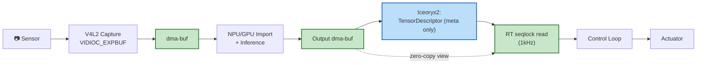

# dczc — Data-Centric Zero-Copy for Physical AI

> **One-liner**: Not another middleware on top of ROS2. We extend the **sensor → accelerator → RT control loop** path with end-to-end zero-copy that doesn't break, and a **bounded staleness that is measured and guaranteed**.

[]()
[](LICENSE)
[]()

> ⚠️ **Status**: design phase. Week 1-2 spike PoC in progress. APIs and implementation are still in flux. This README is a draft written from the perspective of the public release.

---

## The Pitch (60 seconds)

ROS2 + Iceoryx2 integrations provide zero-copy at the **message middleware level**. A message can reach RAM zero-copy, but moving it onto an accelerator (NPU/GPU) typically requires another copy.

`dczc` adds **two missing planes** on top of that:

1. **FD plane** — pass dma-buf FDs directly through a `SCM_RIGHTS` / `pidfd_getfd(2)` sidecar. The dma-buf exported by V4L2 capture is imported by the accelerator driver — **no host memory copy**.
2. **Time plane** — inference runs in a non-RT worker; the RT control loop reads results via a seqlock as a zero-copy view. The staleness bound is computed by an **explicit formula** (7 terms) and is therefore directly usable in safety analysis.

---

## Data Flow at a Glance



Green = zero-copy region. Blue = metadata message. Twelve more diagrams in [`DesignFiles/diagrams.md`](DesignFiles/diagrams.md).

---

## Target Metrics — and what we measured

Measured on a workstation (RTX 5080 / Ryzen 9800X3D, non-RT kernel) against ROS2 Jazzy /
Fast-RTPS on the same workload. Full detail: [docs/hardware-verification.md](docs/hardware-verification.md).

| Metric | Target | Measured (dczc vs ROS2) |
|---|---|---|
| Single-stream latency (1 MiB) | low | **46 µs vs 971 µs — 20.9× lower** ✅ |
| CPU at 295 MB/s (multi-stream) | flat in bandwidth | **0.30 vs 0.98 cores — 3.3× less** ✅ |
| Frame delivery under load | no drops | **100 % vs ~96.7 %** ✅ |
| Memory copies (same bytes) | 0 payload copies | **cache-misses 8.6× lower; ~0 transport syscalls/frame** ✅ |
| Page faults during RT | **0** | **0 / frame** (flat at 20× the frames) ✅ |
| GPU zero-copy import | real hardware | **RTX 5080: 200/200 frames, 0 copies, 1.68 GB** ✅ |
| Staleness bound | sum of 7 explicit terms | deterministic formula (§5) ✅ |
| 1kHz RT worst-case jitter | < 100µs | pending PREEMPT_RT kernel 🟡 |

The formula:
```
worst_case_staleness ≤ 
    T_cap + T_fence_p + T_inf + T_pub
  + T_sc + T_rt_seq + T_view
```
[Definition](DesignFiles/detailed_design_doc.md#5-bounded-staleness-formula) | [Visualization](DesignFiles/diagrams.md#9-bounded-staleness--visualized)

---

## Measured Results

The thesis is that transport cost is **O(1) in payload size**: only fixed-size descriptors
cross the metadata plane while the tensor stays in a shared dma-buf. So as sensor bandwidth
grows, dczc's CPU stays flat while ROS2/DDS scales with the payload it serializes and copies.

**CPU stays flat as bandwidth grows** (serving-robot multi-stream workload, [`benchmarks/mock`](benchmarks/mock/README.md)):


At 295 MB/s dczc uses **0.30 cores vs ROS2's 0.98 (3.3×)** — and drops **zero** frames while
ROS2's worst stream falls to ~96.7 %. The CPU dczc *doesn't* spend on data plumbing is CPU
left for perception and control.

**Single-stream latency, and it widens with payload** ([`benchmarks/`](benchmarks/)):


**Copies aren't free** — same delivered bytes, kernel-measured ([docs/hardware-verification.md](docs/hardware-verification.md)):


ROS2 spends **8.6× the cache-misses** and **5× the instructions** moving the same data.

**Real GPU zero-copy without a robot board.** dczc's FD sidecar carries a live RTX 5080 GPU
memory handle across processes: 200/200 frames validated on-GPU, **0 host payload copies**,
1.68 GB moved zero-copy. Plus RT page-faults measured at **0 per frame**. See
[docs/hardware-verification.md](docs/hardware-verification.md) and the architecture decisions
in [docs/adr/](docs/adr/).

> Numbers are machine-specific — reproduce with `benchmarks/mock/mock_compare.py` and the
> `instrumentation/` suite (all resource-bounded so they won't freeze the box).

---

## 30-Second Demo (work in progress)

```
[ TODO: 30-second video — closed-loop mini demo ]
[ V4L2 camera → NPU inference → 1kHz RT control loop ]
[ Live overlay of the metrics above ]
```

Video drops after the first build (week 9-10).

---

## Quick Build

The full library, examples, Python bindings, benchmarks, and hardware-instrumentation
suite build today:

```bash
cmake -S . -B build -DCMAKE_BUILD_TYPE=Release -DDCZC_BUILD_PYTHON=ON
cmake --build build -j
(cd build && ctest --output-on-failure)      # 8/8, warning-clean

# dczc vs ROS2 benchmarks (ROS2 optional)
python3 benchmarks/mock/mock_compare.py --scales 1,2,3,4 --seconds 5
# real-hardware verification (GPU / page-faults / syscalls / cache)
instrumentation/gpu/build.sh && instrumentation/run_bounded.sh ./build/gpu_sidecar_demo 8 200
```

Optional: `-DDCZC_WITH_ICEORYX2=ON` for the Iceoryx2 metadata backend
(see [docs/metadata-backends.md](docs/metadata-backends.md)).

### Prerequisites

- Linux + PREEMPT_RT-patched kernel (only required for RT validation. The spike PoC alone runs on a stock kernel.)
- A V4L2-compatible camera (a USB UVC camera works)
- One accelerator board:
  - **AMD AI Series** (XDNA NPU) — XDNA driver, ROCm 6.x+
  - **NVIDIA Jetson Orin** — JetPack 6.x, CUDA 12.x
- gcc 11+, cmake 3.22+

### Spike PoC Build (week 1-2 validation)

```bash
# Build both producer and consumer
cmake -S examples/spike_poc -B build/spike -DCMAKE_BUILD_TYPE=Release
cmake --build build/spike -j

# Run (one terminal)
./build/spike/dczc_spike_producer /dev/video0

# Other terminal
./build/spike/dczc_spike_consumer
```

What the PoC validates:
- ✅ V4L2 capture → `VIDIOC_EXPBUF` exports a dma-buf FD
- ✅ `SCM_RIGHTS` delivers the dma-buf FD across processes
- ✅ The received FD is mmap'd as a zero-copy host view (eBPF-verified)
- 🟡 Accelerator import (AMD XDNA / NVIDIA Jetson — decided in spike)

[Spike guide](examples/spike_poc/README.md) | [Spike decision tree](DesignFiles/diagrams.md#12-week-1-2-spike-poc-decision-tree)

---

## API Preview (current header skeleton)

```cpp
#include <dczc/publisher.h>
#include <dczc/subscriber.h>
#include <dczc/pool.h>

// Producer side (non-RT)
auto pool = dczc::TensorPool::create({
    .n_buffers   = 32,
    .buffer_size = 4 * 1024 * 1024,
    .backend     = dczc::PoolBackend::V4L2,
});
auto pub = dczc::TensorPublisher::create("camera/inference_out", *pool);
pub->handshake_pool();  // SCM_RIGHTS bulk transfer

while (running) {
    auto desc = pub->acquire_descriptor();
    fill_shape_dtype(desc, /*...*/);
    // ... write inference output directly into the pool buffer ...
    pub->publish(std::move(desc));
}

// Consumer side (RT 1kHz loop)
auto sub = dczc::TensorSubscriber::create("camera/inference_out");
sub->wait_handshake();
sub->set_fallback_policy(dczc::FallbackPolicy::LastKnownGood);

dczc::rt_setup_memory_and_sched();  // mlockall + MAP_POPULATE + SCHED_FIFO

while (rt_tick()) {
    auto view = sub->latest_view(/*max_retry=*/8);
    if (view) {
        process(view->data, view->shape);
        log_staleness(view->staleness_ns);
    }
    // fallback is applied internally by sub
}
```

[Full API](include/dczc/) | [`TensorDescriptor` definition](DesignFiles/detailed_design_doc.md#112-tensordescriptor-definition-iceoryx2-payload)

---

## FAQ

**Q. ROS2 + Iceoryx2 integrations already exist. Why another?**
A. `rmw_iceoryx_cpp` and Iceoryx2's ROS2 integration give zero-copy at the **message middleware level**. dczc adds the **dma-buf FD sidecar + accelerator import integration layer** on top, so zero-copy is unbroken from sensor through accelerator and into the RT control loop. [Differentiation in detail](DesignFiles/data-centric-zero-copy-design-20260510.md#premises-agreed)

**Q. Can dma-buf FDs be sent through Iceoryx2 SHM?**
A. No. Writing an integer FD into shared memory means nothing in another process — FD tables are per-process. Cross-process FD transfer requires `SCM_RIGHTS` or `pidfd_getfd(2)`. [Sidecar handshake sequence](DesignFiles/diagrams.md#3-fd-handshake-sequence)

**Q. Does the RT loop call NPU inference directly?**
A. No. NPU inference latency has a long tail through P99.99 and is affected by thermal throttling — it cannot be bounded deterministically. dczc runs inference in a non-RT worker; the RT loop reads only the **most recent inference result with a measured/guaranteed staleness bound**, as a zero-copy view via seqlock. [RT pattern](DesignFiles/detailed_design_doc.md#33-rt-consumer-pattern-seqlock)

**Q. Which platform is the first build target?**
A. Decided during the week 1-2 spike PoC. Candidates: **AMD AI Series (XDNA)** and **NVIDIA Jetson Orin**. Apple Silicon is **out of scope for the first build** because macOS lacks V4L2 and Asahi Linux lacks an ANE driver. [Decision tree](DesignFiles/diagrams.md#12-week-1-2-spike-poc-decision-tree)

**Q. Multi-host (distributed) support?**
A. The first build is single-host multi-process only. Multi-host is Phase 4 (zenoh integration or Iceoryx2 distributed mode). [Evolution path](DesignFiles/diagrams.md#11-evolution-path--phase-1--phase-4)

**Q. Can ROS2 users adopt this?**
A. Yes — Phase 3 ships a ROS2 RMW backend (Approach C). The Phase 1 core is a minimal library with no ROS2 dependency, so ROS2 users can adopt it via a thin wrapper.

**Q. License?**
A. Apache 2.0 (with patent grant — friendlier for robotics industry adoption).

---

## Reproducible Benchmark Environment

The current README graphs were measured on a workstation (numbers are machine-specific):

```
- Host: AMD Ryzen 7 9800X3D (16 threads), NVIDIA RTX 5080, 80 GB RAM
- Kernel: Linux 6.17 (non-RT) — 1kHz jitter target pending a PREEMPT_RT kernel
- Middleware: ROS2 Jazzy / Fast-RTPS (default DDS), Iceoryx2 v0.9.2
- Payloads: synthetic tensors; serving-robot multi-stream profile (benchmarks/mock)
- Runner: all under instrumentation/run_bounded.sh (resource-bounded)
```

Full method + raw numbers: [docs/hardware-verification.md](docs/hardware-verification.md).

---

## Design Document Tree

| Document | Role |
|---|---|
| [`DesignFiles/data-centric-zero-copy-design-20260510.md`](DesignFiles/data-centric-zero-copy-design-20260510.md) | Direction, differentiation, risk/mitigation (APPROVED v2) |
| [`DesignFiles/detailed_design_doc.md`](DesignFiles/detailed_design_doc.md) | Mechanism details (14 sections, ~700 lines) |
| [`DesignFiles/diagrams.md`](DesignFiles/diagrams.md) | 12 Mermaid diagrams |
| [`docs/adr/`](docs/adr/) | Architecture Decision Records (why, with measured evidence) |
| [`docs/hardware-verification.md`](docs/hardware-verification.md) | Measured results (GPU zero-copy, page-faults, syscalls, cache) |
| [`docs/metadata-backends.md`](docs/metadata-backends.md) | Seqlock vs Iceoryx2 backend |
| `examples/spike_poc/README.md` | Week 1-2 spike PoC guide |

---

## Roadmap

- [x] Office hours → differentiation, audience, scope locked in
- [x] Design doc v2 (APPROVED, reviewer score 5/10 → projected 8/10)
- [x] Mechanism detail document (~700 lines)
- [x] System diagrams (12 Mermaid views)
- [x] API header skeleton
- [ ] Week 1-2 spike PoC validation (← **current**)
- [ ] Week 4: TensorDescriptor + sidecar handshake formal implementation
- [ ] Week 6: accelerator import backend
- [ ] Week 8: RT consumer + closed-loop integration
- [ ] Week 10: cyclictest 24h + eBPF zero-copy verification
- [ ] Week 12: ROS2 baseline comparison benchmark
- [ ] Week 14: public release + video + external demos

---

## Contributing

This is a design-stage project. Issues and discussions are welcome. PRs will start being accepted after the spike PoC validates.

## License

Apache 2.0 — see [LICENSE](LICENSE)
