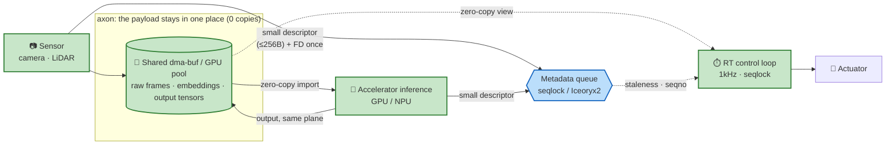
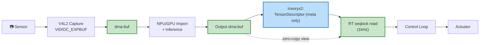

<!-- README.md (English) is the source of truth. When you change it, update README.ko.md in the SAME commit so the two stay in sync. -->

<p align="center">
  
</p>

# Axon — Data-Centric Zero-Copy for Physical AI

**English** | [한국어](README.ko.md)

> **One-liner**: Not another middleware on top of ROS2. We extend the **sensor → accelerator → RT control loop** path with end-to-end zero-copy that doesn't break, and a **bounded staleness that is measured and guaranteed**.

[]()
[](LICENSE)
[]()

> **Status**: working library + measured results. Core is built and tested (9/9); benchmarks, hardware verification, ROS1/ROS2 integration, a VLM handoff demo, and a cross-process GPU accelerator pool all land on this dev PC (RTX 5080). New here? See **[docs/usage.md](docs/usage.md)**, [Measured Results](#measured-results), and [docs/hardware-verification.md](docs/hardware-verification.md).

---

## Overview

**What.** `axon` keeps the tensor **payload in a shared dma-buf (or GPU allocation)** and lets every process and accelerator reference it *in place*. Only a fixed-size descriptor (≤256 B) crosses the queue; the buffer's FD is handed over once through an `SCM_RIGHTS` sidecar. In one line: **don't move the payload — leave it where it is and pass a reference.**

**Why.** Physical AI on a robot needs **high bandwidth, ultra-low latency, and RT determinism at the same time**, along the `sensor → accelerator → RT control` path. Standard middleware (ROS2 + DDS) copies each tensor several times per frame, so latency and CPU grow **with payload size** — exactly where robots move the most bytes (4K cameras, point clouds, image embeddings) — and staleness drifts with load, which makes it unusable in safety analysis. Message-level zero-copy (Iceoryx2) gets a message to RAM, but **putting it onto an accelerator copies again**, and the RT freshness guarantee is still missing. `axon` closes both gaps.

One picture says it: **green (the payload) stays in one place; only blue (small metadata) moves.**



Green = payload, referenced in place and never copied. Blue = the only thing that crosses the queue. (The concrete per-stage pipeline is in [Data Flow at a Glance](#data-flow-at-a-glance); the copy-heavy ROS2/DDS path it replaces is the 4-copy chain that path removes.)

**What you get** — transport cost is **O(1) in payload size**, so as bandwidth grows axon CPU stays flat while ROS2/DDS scales with the bytes it copies. Measured on this dev PC:

### Headline results (measured, RTX 5080 / Ryzen 9800X3D vs ROS2/Fast-RTPS)

| What | Result |
|---|---|
| Single-stream latency (1 MiB) | **20.9× lower** (46 µs vs 971 µs) |
| Multi-stream CPU @ 295 MB/s | **3.3× less** + zero dropped frames |
| Memory (same bytes) | **8.6× fewer cache-misses**, ~0 syscalls/frame |
| RT loop page faults | **0 / frame** |
| GPU cross-process share | **zero-copy**, 200/200 frames, 1.68 GB |
| VLM encoder→LLM handoff (video 34 MB) | **36× faster** than a host round-trip |

Full detail in [Measured Results](#measured-results); the staleness guarantee is in [Target Metrics](#target-metrics--and-what-we-measured).

---

## The Pitch (60 seconds)

ROS2 + Iceoryx2 integrations provide zero-copy at the **message middleware level**. A message can reach RAM zero-copy, but moving it onto an accelerator (NPU/GPU) typically requires another copy.

`axon` adds **two missing planes** on top of that:

1. **FD plane** — pass dma-buf FDs directly through a `SCM_RIGHTS` / `pidfd_getfd(2)` sidecar. The dma-buf exported by V4L2 capture is imported by the accelerator driver — **no host memory copy**.
2. **Time plane** — inference runs in a non-RT worker; the RT control loop reads results via a seqlock as a zero-copy view. The staleness bound is computed by an **explicit formula** (7 terms) and is therefore directly usable in safety analysis.

---

## Data Flow at a Glance



Green = zero-copy region. Blue = metadata message. Twelve more diagrams in [`DesignFiles/diagrams.md`](DesignFiles/diagrams.md).

---

## Target Metrics — and what we measured

Measured on a workstation (RTX 5080 / Ryzen 9800X3D, non-RT kernel) against ROS2 Jazzy /
Fast-RTPS on the same workload. Full detail: [docs/hardware-verification.md](docs/hardware-verification.md).

| Metric | Target | Measured (axon vs ROS2) |
|---|---|---|
| Single-stream latency (1 MiB) | low | **46 µs vs 971 µs — 20.9× lower** ✅ |
| CPU at 295 MB/s (multi-stream) | flat in bandwidth | **0.30 vs 0.98 cores — 3.3× less** ✅ |
| Frame delivery under load | no drops | **100 % vs ~96.7 %** ✅ |
| Memory copies (same bytes) | 0 payload copies | **cache-misses 8.6× lower; ~0 transport syscalls/frame** ✅ |
| Page faults during RT | **0** | **0 / frame** (flat at 20× the frames) ✅ |
| GPU zero-copy import | real hardware | **RTX 5080: 200/200 frames, 0 copies, 1.68 GB** ✅ |
| Staleness bound | sum of 7 explicit terms | deterministic formula (§5) ✅ |
| 1kHz RT worst-case jitter | < 100µs | pending PREEMPT_RT kernel 🟡 |

The formula:
```
worst_case_staleness ≤ 
    T_cap + T_fence_p + T_inf + T_pub
  + T_sc + T_rt_seq + T_view
```
[Definition](DesignFiles/detailed_design_doc.md#5-bounded-staleness-formula) | [Visualization](DesignFiles/diagrams.md#9-bounded-staleness--visualized)

---

## Measured Results

The thesis is that transport cost is **O(1) in payload size**: only fixed-size descriptors
cross the metadata plane while the tensor stays in a shared dma-buf. So as sensor bandwidth
grows, axon's CPU stays flat while ROS2/DDS scales with the payload it serializes and copies.

**CPU stays flat as bandwidth grows** (serving-robot multi-stream workload, [`benchmarks/mock`](benchmarks/mock/README.md)):


At 295 MB/s axon uses **0.30 cores vs ROS2's 0.98 (3.3×)** — and drops **zero** frames while
ROS2's worst stream falls to ~96.7 %. The CPU axon *doesn't* spend on data plumbing is CPU
left for perception and control.

**Single-stream latency, and it widens with payload** ([`benchmarks/`](benchmarks/)):


**Copies aren't free** — same delivered bytes, kernel-measured ([docs/hardware-verification.md](docs/hardware-verification.md)):


ROS2 spends **8.6× the cache-misses** and **5× the instructions** moving the same data.

**Real GPU zero-copy without a robot board.** axon's FD sidecar carries a live RTX 5080 GPU
memory handle across processes: 200/200 frames validated on-GPU, **0 host payload copies**,
1.68 GB moved zero-copy. Plus RT page-faults measured at **0 per frame**. See
[docs/hardware-verification.md](docs/hardware-verification.md) and the architecture decisions
in [docs/adr/](docs/adr/).

> Numbers are machine-specific — reproduce with `benchmarks/mock/mock_compare.py` and the
> `instrumentation/` suite (all resource-bounded so they won't freeze the box).

---

## 30-Second Demo (work in progress)

```
[ TODO: 30-second video — closed-loop mini demo ]
[ V4L2 camera → NPU inference → 1kHz RT control loop ]
[ Live overlay of the metrics above ]
```

Closed-loop video demo pending a real sensor + robot board; the GPU/RT data path it exercises is already measured on this dev PC (see [Measured Results](#measured-results)).

---

## Quick Build

The full library, examples, Python bindings, benchmarks, and hardware-instrumentation
suite build today:

```bash
cmake -S . -B build -DCMAKE_BUILD_TYPE=Release -DAXON_BUILD_PYTHON=ON
cmake --build build -j
(cd build && ctest --output-on-failure)      # 9/9, warning-clean

# axon vs ROS2 benchmarks (ROS2 optional)
python3 benchmarks/mock/mock_compare.py --scales 1,2,3,4 --seconds 5
# real-hardware verification (GPU / page-faults / syscalls / cache)
instrumentation/gpu/build.sh && instrumentation/run_bounded.sh ./build/gpu_sidecar_demo 8 200
```

New here? Start with **[docs/usage.md](docs/usage.md)** — copy-paste producer/consumer,
RT loop, Python, and GPU examples, each mapped to a tested demo.

Optional feature flags (all default off — the core stays dependency-free):
- `-DAXON_WITH_ICEORYX2=ON` — Iceoryx2 metadata backend ([docs/metadata-backends.md](docs/metadata-backends.md)).
- `-DAXON_WITH_CUDA=ON` — `PoolBackend::Accelerator` CUDA VMM device pool for cross-process GPU zero-copy ([docs/usage.md §4](docs/usage.md#4-cross-process-gpu-zero-copy-accelerator-pool-r6)).

### Prerequisites

- Linux + PREEMPT_RT-patched kernel (only required for RT validation. The spike PoC alone runs on a stock kernel.)
- A V4L2-compatible camera (a USB UVC camera works)
- One accelerator board:
  - **AMD AI Series** (XDNA NPU) — XDNA driver, ROCm 6.x+
  - **NVIDIA Jetson Orin** — JetPack 6.x, CUDA 12.x
- gcc 11+, cmake 3.22+

### Spike PoC Build (week 1-2 validation)

```bash
# Build both producer and consumer
cmake -S examples/spike_poc -B build/spike -DCMAKE_BUILD_TYPE=Release
cmake --build build/spike -j

# Run (one terminal)
./build/spike/axon_spike_producer /dev/video0

# Other terminal
./build/spike/axon_spike_consumer
```

What the PoC validates:
- ✅ V4L2 capture → `VIDIOC_EXPBUF` exports a dma-buf FD
- ✅ `SCM_RIGHTS` delivers the dma-buf FD across processes
- ✅ The received FD is mmap'd as a zero-copy host view (eBPF-verified)
- 🟡 Accelerator import (AMD XDNA / NVIDIA Jetson — decided in spike)

[Spike guide](examples/spike_poc/README.md) | [Spike decision tree](DesignFiles/diagrams.md#12-week-1-2-spike-poc-decision-tree)

---

## API at a glance

The library is implemented and tested — not a skeleton. Full runnable examples
(producer/consumer, RT loop, Python, GPU) are in **[docs/usage.md](docs/usage.md)**;
here is the shape of it.

```cpp
#include <axon/publisher.h>
#include <axon/subscriber.h>
#include <axon/pool.h>

// Producer side (non-RT)
auto pool = axon::TensorPool::create({
    .n_buffers   = 32,
    .buffer_size = 4 * 1024 * 1024,
    .backend     = axon::PoolBackend::Custom,   // Custom/UDMABUF/V4L2/Accelerator
    .v4l2_device = nullptr,
});
auto pub = axon::TensorPublisher::create("camera/inference_out", *pool);
pub->handshake_pool();  // SCM_RIGHTS bulk transfer

while (running) {
    axon::AcquiredDescriptor a = pub->acquire_descriptor();
    // ... write the frame straight into a.host_view, stamp a.desc ...
    pub->publish(std::move(a));
}

// Consumer side (RT 1kHz loop)
auto sub = axon::TensorSubscriber::create("camera/inference_out");
sub->wait_handshake();
sub->set_fallback_policy(axon::FallbackPolicy::LastKnownGood);

axon::rt_setup_memory_and_sched();  // mlockall + prefault + SCHED_FIFO

while (rt_tick()) {
    auto view = sub->latest_view(/*max_retry=*/8);
    if (view) {
        process(view->data, view->shape);
        log_staleness(view->staleness_ns);
    }
    // fallback is applied internally by sub
}
```

[Usage & examples](docs/usage.md) | [Full API headers](include/axon/) | [`TensorDescriptor` definition](DesignFiles/detailed_design_doc.md#112-tensordescriptor-definition-iceoryx2-payload)

---

## FAQ

**Q. ROS2 + Iceoryx2 integrations already exist. Why another?**
A. `rmw_iceoryx_cpp` and Iceoryx2's ROS2 integration give zero-copy at the **message middleware level**. axon adds the **dma-buf FD sidecar + accelerator import integration layer** on top, so zero-copy is unbroken from sensor through accelerator and into the RT control loop. [Differentiation in detail](DesignFiles/data-centric-zero-copy-design-20260510.md#premises-agreed)

**Q. Can dma-buf FDs be sent through Iceoryx2 SHM?**
A. No. Writing an integer FD into shared memory means nothing in another process — FD tables are per-process. Cross-process FD transfer requires `SCM_RIGHTS` or `pidfd_getfd(2)`. [Sidecar handshake sequence](DesignFiles/diagrams.md#3-fd-handshake-sequence)

**Q. Does the RT loop call NPU inference directly?**
A. No. NPU inference latency has a long tail through P99.99 and is affected by thermal throttling — it cannot be bounded deterministically. axon runs inference in a non-RT worker; the RT loop reads only the **most recent inference result with a measured/guaranteed staleness bound**, as a zero-copy view via seqlock. [RT pattern](DesignFiles/detailed_design_doc.md#33-rt-consumer-pattern-seqlock)

**Q. Which platform is the first build target?**
A. Decided during the week 1-2 spike PoC. Candidates: **AMD AI Series (XDNA)** and **NVIDIA Jetson Orin**. Apple Silicon is **out of scope for the first build** because macOS lacks V4L2 and Asahi Linux lacks an ANE driver. [Decision tree](DesignFiles/diagrams.md#12-week-1-2-spike-poc-decision-tree)

**Q. Multi-host (distributed) support?**
A. The first build is single-host multi-process only. Multi-host is Phase 4 (zenoh integration or Iceoryx2 distributed mode). [Evolution path](DesignFiles/diagrams.md#11-evolution-path--phase-1--phase-4)

**Q. Can ROS2 users adopt this?**
A. Yes — Phase 3 ships a ROS2 RMW backend (Approach C). The Phase 1 core is a minimal library with no ROS2 dependency, so ROS2 users can adopt it via a thin wrapper.

**Q. License?**
A. Apache 2.0 (with patent grant — friendlier for robotics industry adoption).

---

## Reproducible Benchmark Environment

The current README graphs were measured on a workstation (numbers are machine-specific):

```
- Host: AMD Ryzen 7 9800X3D (16 threads), NVIDIA RTX 5080, 80 GB RAM
- Kernel: Linux 6.17 (non-RT) — 1kHz jitter target pending a PREEMPT_RT kernel
- Middleware: ROS2 Jazzy / Fast-RTPS (default DDS), Iceoryx2 v0.9.2
- Payloads: synthetic tensors; serving-robot multi-stream profile (benchmarks/mock)
- Runner: all under instrumentation/run_bounded.sh (resource-bounded)
```

Full method + raw numbers: [docs/hardware-verification.md](docs/hardware-verification.md).

---

## Design Document Tree

| Document | Role |
|---|---|
| [`docs/usage.md`](docs/usage.md) | **Usage & examples** — copy-paste C++/Python/GPU snippets, each mapped to a tested demo |
| [`DesignFiles/data-centric-zero-copy-design-20260510.md`](DesignFiles/data-centric-zero-copy-design-20260510.md) | Direction, differentiation, risk/mitigation (APPROVED v2) |
| [`DesignFiles/detailed_design_doc.md`](DesignFiles/detailed_design_doc.md) | Mechanism details (14 sections, ~700 lines) |
| [`DesignFiles/diagrams.md`](DesignFiles/diagrams.md) | 12 Mermaid diagrams |
| [`docs/adr/`](docs/adr/) | Architecture Decision Records (why, with measured evidence) |
| [`docs/hardware-verification.md`](docs/hardware-verification.md) | Measured results (GPU zero-copy, page-faults, syscalls, cache) |
| [`docs/metadata-backends.md`](docs/metadata-backends.md) | Seqlock vs Iceoryx2 backend |
| `examples/spike_poc/README.md` | Week 1-2 spike PoC guide |

---

## Roadmap

Design → working library + measured results. Done (merged to `main`):

- [x] Design doc v2, mechanism detail (~700 lines), 12 Mermaid diagrams
- [x] Spike PoC — V4L2 `VIDIOC_EXPBUF` → `SCM_RIGHTS` → mmap'd zero-copy view
- [x] Core library — sidecar (FD plane) + seqlock metadata + dma-buf pool + RT helpers + pub/sub
- [x] Python bindings (zero-copy NumPy)
- [x] Iceoryx2 lock-free SHM metadata backend (`AXON_WITH_ICEORYX2`)
- [x] ROS2 single-stream + multi-stream (MockSystem) benchmarks
- [x] Hardware verification on RTX 5080 — GPU zero-copy, page-faults, syscalls, perf/cache
- [x] ROS1 integration — descriptor-topic offload (M1) **+ drop-in `axon` `image_transport` plugin (M2)**, on a reusable ROS-agnostic `axon_bridge` (Docker-verified: 232/232 frames, 0 payload copies)
- [x] Depth wire v2 (row_pitch / depth_scale / intrinsics) + validation
- [x] VLM encoder→LLM handoff benchmark (up to 36×)
- [x] **R6 accelerator pool** — `PoolBackend::Accelerator` CUDA VMM device zero-copy (`AXON_WITH_CUDA`)
- [x] **R2 sync-fence** — `sync_file` fence surfaced in `latest_view` for producer→consumer ordering; non-RT `drain_fences()` keeps the RT read syscall-free (fence-gated frame skipped until its fence arrives)
- [x] **Direction A — vision→LLM zero-copy** — framework tensor ↔ axon GPU buffer via `__cuda_array_interface__` on both the producer (`device_array`) and the consumer (`latest_view`), plus consumer-side CUDA VMM import. Working two-process demo (`examples/vla_demo/`: DeiT-tiny → axon → GPT-2 prefill, same GPU pointer both sides, no host copy)
- [x] **Direction D — NVENC data flywheel** — record the stream to disk straight from the shared GPU buffer: the recorder feeds each `latest_view()` to hardware NVENC with no host copy (`examples/nvenc_flywheel/`, decode-verified H.264)

Next:

- [ ] `cyclictest` 1 kHz jitter on a PREEMPT_RT kernel (needs the target board)
- [ ] Accelerator formal backends (AMD XDNA / Jetson) + real sensor / real robot integration

---

## Contributing

Working library, pre-alpha and moving fast. Issues, discussions, and PRs are welcome. The core has zero required dependencies and builds/tests green (9/9) on a stock Linux box — see [docs/usage.md](docs/usage.md) to get started.

> **Docs are bilingual.** `README.md` (English) is the source of truth; `README.ko.md` (한국어) mirrors it. Edit **both in the same commit** when you change either.

## License

Apache 2.0 — see [LICENSE](LICENSE)
