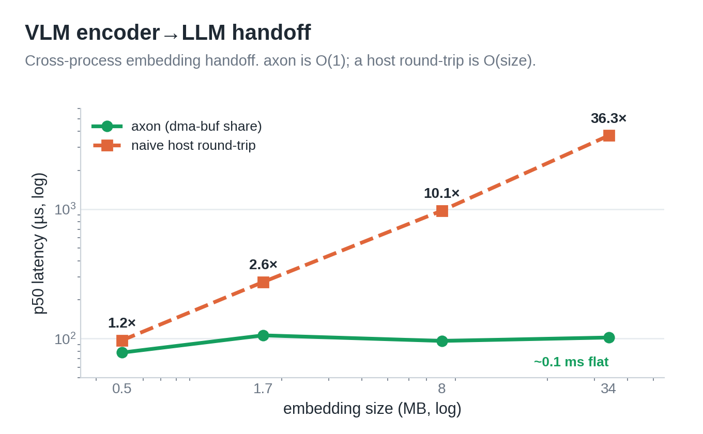

# Hardware instrumentation — proving performance without a robot board

These tools demonstrate axon's core claims on **this development PC's own hardware**
(RTX 5080 GPU, 16-core CPU, kernel tracing) — no robot/accelerator board required.
Every run goes through a **resource harness** so verification never freezes the box.

> 📄 Measured results with full context: [`docs/hardware-verification.md`](../docs/hardware-verification.md).

| Demo | Proves | Privilege | Status |
|---|---|---|---|
| `gpu/gpu_sidecar_demo` | axon sidecar carries a **real GPU memory handle** → zero-copy GPU↔GPU across processes | none | ✅ verified |
| `perf/run_pagefaults.sh` | RT loop adds **0 page faults/frame** (mlockall/MAP_POPULATE) | none | ✅ verified |
| `perf/run_syscalls.sh` | axon payload path is **0 transport syscalls/frame** vs ROS2's DDS | none | ✅ verified |
| `perf/run_membw.sh` | ROS2 burns **8.6× the cache-misses** copying payloads; axon doesn't | perf (paranoid≤1) | ✅ verified |
| `ebpf/run_copy_compare.sh` | direct `copy_to_user` byte count | sudo (bpftrace) | tool |

## 0. Resource harness (freeze protection)

`run_bounded.sh` wraps any command with a **hard CPU-core pin** (`taskset`), a cgroup
**memory ceiling** + no-swap (`systemd-run --user`), lowered priority, and a wall-clock
**timeout**. Even a runaway loop can only saturate the pinned cores — the desktop stays
responsive.

```bash
AXON_CORES=0-5 AXON_MEM=8G AXON_TIMEOUT=120 instrumentation/run_bounded.sh <cmd...>
```

Defaults on a 16-core box: 6 cores, 8 GB, 120 s. Everything below routes through it.

## 1. GPU accelerator — real zero-copy across processes (RTX 5080) ✅

The RTX 5080 *is* an accelerator. This turns the "accelerator import backend (needs a
board)" roadmap item into a live demo on the discrete GPU.

**Path:** a producer allocates CUDA VMM memory, a kernel fills it, the allocation is
exported as a POSIX shareable FD, and that FD is delivered through axon's SCM_RIGHTS
sidecar (`axon::detail::send_fds`). The consumer imports the *same physical GPU memory*
and a kernel verifies the payload — the tensor never leaves the GPU; only a 32-byte
commit record crosses host↔device (for sync), never the payload. (design doc §2.3:
`bo_handle` → GPU memory handle.)

```bash
cmake -S . -B build && cmake --build build -j     # builds libaxon.a
instrumentation/gpu/build.sh                        # nvcc → build/gpu_sidecar_demo
AXON_CORES=0-3 AXON_TIMEOUT=40 instrumentation/run_bounded.sh \
    ./build/gpu_sidecar_demo 8 200                  # 8 MB/frame × 200 frames
```

**Verified output** (RTX 5080, driver 580 open module, CUDA 12.8):

```
frames validated:    200 / 200   (on-GPU checksum)
corrupt frames:      0
host PAYLOAD copies:  0   (only a 32B commit record crosses host<->device)
GPU data moved zero-copy: 1.68 GB across the process boundary
commit->verify latency: mean=197.9us max=327.6us
FD transport: axon::detail::send_fds / recv_fds (SCM_RIGHTS sidecar)
```

> Note: `CU_DEVICE_ATTRIBUTE_DMA_BUF_SUPPORTED` was 0 on this driver config, so the demo
> uses CUDA VMM's POSIX shareable handle (also carried by the same sidecar). The proof —
> a GPU memory handle crossing the process boundary via axon's FD plane, zero payload
> copy — is identical.

## 2. RT page faults = 0 per frame ✅

```bash
instrumentation/perf/run_pagefaults.sh
```

Uses `/usr/bin/time -v` (getrusage) — **no sudo**. Runs the C++ closed-loop demo at 100
vs 2000 frames; if the loop faulted per frame, faults would scale 20×.

**Verified:**

| frames | Minor page-faults | Major (disk) faults |
|---|---|---|
| 100 | 2191 | 3 (one-time binary load) |
| 2000 (20×) | **2191** | **0** |

Identical minor faults despite 20× the frames → the RT streaming loop adds **0 page
faults per frame**; major faults stay 0. The `mlockall` / `MAP_POPULATE` / prefault path
(design doc §3.2, §5.4) holds.

## 3. Data-path syscalls = 0 per frame ✅

```bash
instrumentation/perf/run_syscalls.sh 1 2
```

`strace -f -c` (no sudo) counts transport syscalls. **Verified** (scale 1, ~964 frames,
8 streams):

| | axon | ROS2 (Fast-RTPS) |
|---|---|---|
| total syscalls | **404** | 10,187 (**25×**) |
| transport (send/recv msg+to+from) | **16** (one-time handshake) | 516 |
| per-frame transport syscalls | **~0** (8 sendmsg / 964 frames) | ~0.5 |

axon publishes each frame with a seqlock store into shared memory — after the one-time FD
handshake (8 sendmsg for 8 streams), the payload never touches a syscall. ROS2 runs the
DDS machinery for every frame.

## 4. Memory-subsystem cost — copies aren't free ✅

```bash
instrumentation/perf/run_membw.sh 2 4        # perf, no sudo when paranoid≤1
```

`perf stat` compares cache/instruction cost for the same delivered bytes. **Verified**
(scale 2 ≈ 148 MB/s, 4 s):

| counter | axon | ROS2 | ratio |
|---|---|---|---|
| cache-references | 131 M | 925 M | 7.0× |
| cache-misses | **15.0 M** | **128.2 M** | **8.6×** |
| instructions | 4.9 B | 24.8 B | 5.1× |
| context-switches | 6,931 | 10,427 | 1.5× |

ROS2 serializes+copies every payload (both sides), spending ~8.6× the cache-misses and
~5× the instructions axon does to move the same data. This is the memory-side companion to
the CPU result in [`benchmarks/mock`](../benchmarks/mock/README.md) (axon flat vs ROS2
3.3× CPU at scale 4).

## 5. Direct copy_to_user byte count (sudo — optional)

```bash
sudo instrumentation/ebpf/run_copy_compare.sh 2 4
```

`bpftrace` counts `_copy_to_user`/`_copy_from_user` bytes by process. This is the only
tool that still needs root (bpftrace requires it); the §1–§4 results above already
quantify the copy cost without it.

## 6. VLM embedding handoff — encoder→LLM zero-copy (RTX 5080) ✅

A vision encoder (process A) produces an embedding on the GPU; an LLM (process B)
must consume it. The naive cross-process path when two frameworks can't share GPU
memory is `cudaMemcpy DtoH → socket → cudaMemcpy HtoD` — 2 copies, O(embedding
size). With axon the buffer is CUDA VMM memory shared once via the SCM_RIGHTS
sidecar, so the encoder writes and the LLM reads **in place** (0 host copies, O(1)).

```bash
instrumentation/gpu/build.sh                        # builds vlm_handoff_bench
instrumentation/run_bounded.sh ./build/vlm_handoff_bench
```

**Verified** (200 frames/size, real VLM embedding shapes):

| embedding | axon p50 | naive p50 | speedup |
|---|---|---|---|
| DINOv2-L 257×1024 (0.5 MB) | 78 µs | 97 µs | 1.2× |
| SigLIP-L 729×1152 (1.7 MB) | 106 µs | 274 µs | 2.6× |
| hi-res 2048×2048 (8 MB) | 96 µs | 975 µs | 10.1× |
| video 4×2048×2048 (34 MB) | 102 µs | 3710 µs | **36.3×** |



axon handoff is ~flat (~0.1 ms, the sync + verify) while the naive path grows
linearly with embedding size. At multimodal/video scale it's **36× faster** — this
is the O(1)-vs-O(size) thesis in the VLM (= half of VLA) context. (`vlm_handoff_bench.cu`
uses a kernel as the "encoder write" and real embedding sizes; transport cost is
model-independent, so no pretrained model is needed.)

---

*All demos are resource-bounded via `run_bounded.sh`. `perf` runs unprivileged once
`kernel.perf_event_paranoid` is ≤ 1 (`sudo sysctl kernel.perf_event_paranoid=1`);
only the raw `bpftrace` copy counter needs full root.*
